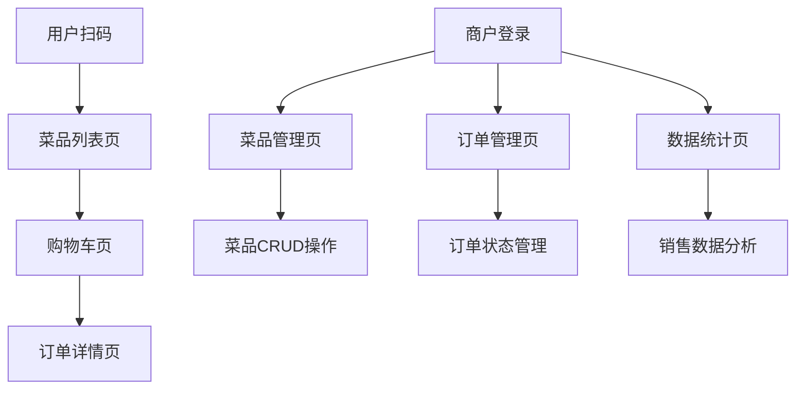

# 烧烤摆摊点单小程序产品需求文档

## 1. 产品概述

烧烤摆摊点单小程序是一个基于微信小程序的多角色点餐系统，支持用户扫码点餐和商户管理功能。用户可以通过扫描商户二维码进入点餐页面，浏览菜品并下单；商户可以管理菜品、处理订单并查看销售统计。

该系统旨在帮助烧烤摊主实现数字化经营，提升点餐效率，减少人工成本，为顾客提供便捷的点餐体验。

## 2. 核心功能

### 2.1 用户角色

| 角色 | 注册方式 | 核心权限 |
|------|----------|----------|
| 普通用户 | 微信小程序授权登录 | 扫码点餐、浏览菜品、购物车管理、订单查看 |
| 商户用户 | 账号密码注册登录 | 菜品管理、订单管理、数据统计、商户信息管理 |

### 2.2 功能模块

我们的烧烤摆摊点单小程序包含以下主要页面：

1. **用户端页面**：菜品列表页、购物车页、订单详情页
2. **商户端页面**：登录页、菜品管理页、订单管理页、数据统计页
3. **公共组件**：顶部导航栏、订单状态标签、API调用封装

### 2.3 页面详情

| 页面名称 | 模块名称 | 功能描述 |
|----------|----------|----------|
| 用户端-菜品列表页 | 商户信息展示 | 根据扫码获取的商户ID显示商户基本信息 |
| 用户端-菜品列表页 | 菜品浏览模块 | 展示菜品图片、名称、价格，支持添加到购物车 |
| 用户端-购物车页 | 购物车管理 | 查看已选菜品、修改数量、选择堂食/打包 |
| 用户端-购物车页 | 订单提交 | 确认订单信息并提交，初始状态为待确认 |
| 用户端-订单详情页 | 订单状态跟踪 | 实时显示订单状态：待确认→待叫号→待取餐 |
| 用户端-订单详情页 | 排队信息 | 显示当前排队号码和预计等待时间 |
| 商户端-登录页 | 用户认证 | 账号密码登录，JWT token验证 |
| 商户端-菜品管理页 | 菜品CRUD | 新增、编辑、删除菜品，支持图片上传 |
| 商户端-订单管理页 | 订单处理 | 接收新订单、确认订单、更新订单状态 |
| 商户端-数据统计页 | 销售统计 | 查看每日/每周/每月销售额和订单数量，图表展示 |

## 3. 核心流程

### 用户点餐流程

1. 用户扫描商户二维码进入小程序
2. 根据商户ID获取并浏览菜品列表
3. 选择菜品添加到购物车
4. 进入购物车选择堂食/打包，确认订单
5. 提交订单，状态变为"待确认"
6. 查看订单状态和排队号

### 商户管理流程

1. 商户使用账号密码登录系统
2. 管理菜品信息（增删改查、图片上传）
3. 接收并确认新订单（状态：待确认→待烹饪）
4. 完成制作后更新状态为"待取餐"
5. 查看销售数据和统计报表

## 4. 用户界面设计

### 4.1 设计风格

- **主色调**：#FF6B35（橙红色）作为主色，#FFFFFF（白色）作为背景色
- **辅助色**：#F8F9FA（浅灰）用于卡片背景，#6C757D（深灰）用于文字
- **按钮样式**：圆角矩形按钮，主按钮使用橙红色背景白色文字
- **字体**：微信小程序系统默认字体，标题使用粗体
- **布局风格**：卡片式布局，底部标签栏导航
- **图标风格**：使用uni-app内置图标，简洁现代风格

### 4.2 页面设计概览

| 页面名称 | 模块名称 | UI元素 |
|----------|----------|--------|
| 用户端-菜品列表页 | 商户信息区 | 商户名称18px粗体，营业状态绿色圆点标识 |
| 用户端-菜品列表页 | 菜品卡片 | 左侧120x120px菜品图片，右侧菜品信息，价格橙色高亮 |
| 用户端-购物车页 | 菜品列表 | 白色卡片背景，数量选择器，删除按钮 |
| 用户端-订单详情页 | 状态进度条 | 三段式进度条，当前状态橙色高亮 |
| 商户端-登录页 | 登录表单 | 居中布局，输入框圆角设计，登录按钮全宽度 |
| 商户端-菜品管理页 | 菜品列表 | 列表式布局，操作按钮使用不同颜色区分 |
| 商户端-订单管理页 | 订单卡片 | 卡片式布局，状态标签不同颜色，操作按钮右对齐 |
| 商户端-数据统计页 | 图表区域 | 使用uCharts图表库，折线图和柱状图，响应式布局 |

### 4.3 响应式设计

- **移动端优先**：专为微信小程序设计，适配不同尺寸手机屏幕
- **触摸优化**：按钮和交互元素适合手指操作，最小点击区域44px
- **加载优化**：图片懒加载，分页加载数据，提升用户体验