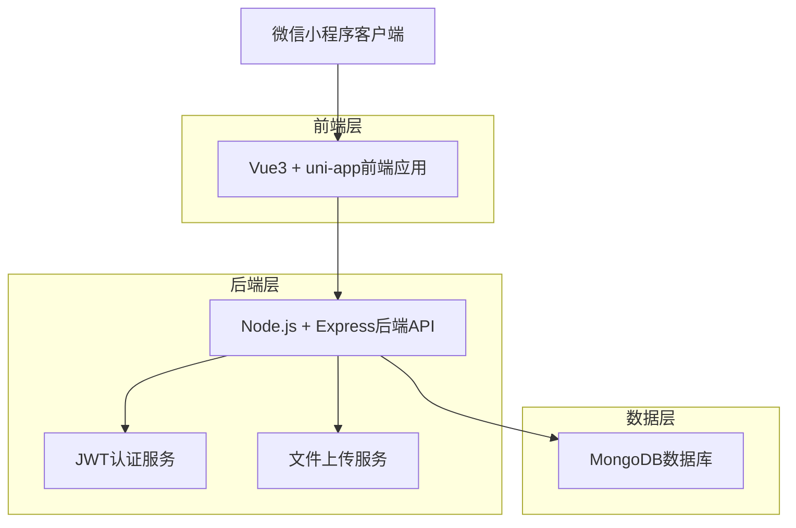
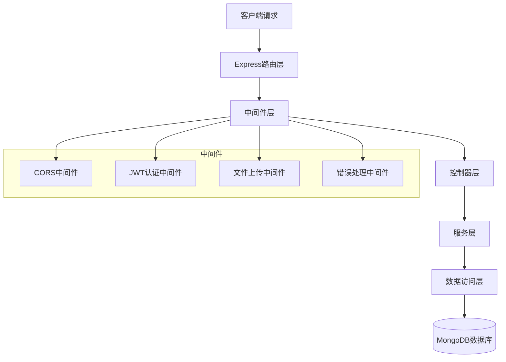
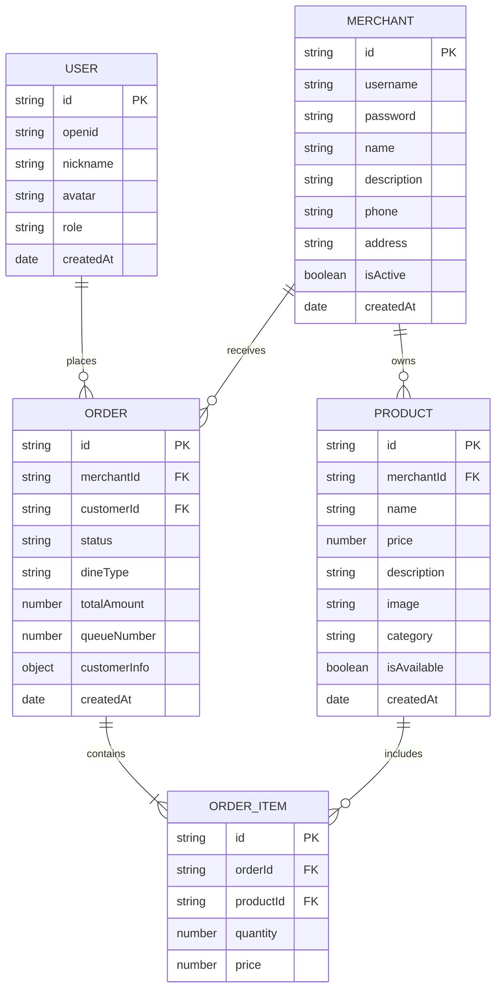

# 烧烤摆摊点单小程序技术架构文档

## 1. 架构设计



## 2. 技术描述

- **前端**：Vue3 + uni-app + uView UI组件库 + uCharts图表库
- **后端**：Node.js + Express + JWT + Multer（文件上传）
- **数据库**：MongoDB + Mongoose ODM
- **部署**：后端部署到Railway/Render，数据库使用MongoDB Atlas

## 3. 路由定义

| 路由 | 用途 |
|------|------|
| /pages/index/index | 首页，根据用户角色跳转到不同页面 |
| /pages/menu/menu | 菜品列表页，用户浏览菜品 |
| /pages/cart/cart | 购物车页，确认订单信息 |
| /pages/order/order | 订单详情页，查看订单状态 |
| /pages/login/login | 登录页，商户登录认证 |
| /pages/merchant/product | 商户菜品管理页 |
| /pages/merchant/order | 商户订单管理页 |
| /pages/merchant/stats | 商户数据统计页 |

## 4. API定义

### 4.1 用户认证相关

**商户登录**
```
POST /api/auth/login
```

请求参数：
| 参数名 | 参数类型 | 是否必需 | 描述 |
|--------|----------|----------|------|
| username | string | true | 商户用户名 |
| password | string | true | 密码 |

响应参数：
| 参数名 | 参数类型 | 描述 |
|--------|----------|------|
| success | boolean | 请求是否成功 |
| token | string | JWT认证令牌 |
| user | object | 用户信息 |

**微信用户授权**
```
POST /api/auth/wechat
```

请求参数：
| 参数名 | 参数类型 | 是否必需 | 描述 |
|--------|----------|----------|------|
| code | string | true | 微信授权码 |

### 4.2 菜品管理相关

**获取菜品列表**
```
GET /api/products/:merchantId
```

**创建菜品**
```
POST /api/products
```

请求参数：
| 参数名 | 参数类型 | 是否必需 | 描述 |
|--------|----------|----------|------|
| name | string | true | 菜品名称 |
| price | number | true | 菜品价格 |
| description | string | false | 菜品描述 |
| image | string | false | 菜品图片URL |
| category | string | false | 菜品分类 |

**更新菜品**
```
PUT /api/products/:id
```

**删除菜品**
```
DELETE /api/products/:id
```

### 4.3 订单管理相关

**创建订单**
```
POST /api/orders
```

请求参数：
| 参数名 | 参数类型 | 是否必需 | 描述 |
|--------|----------|----------|------|
| merchantId | string | true | 商户ID |
| items | array | true | 订单商品列表 |
| dineType | string | true | 堂食/打包 |
| totalAmount | number | true | 订单总金额 |
| customerInfo | object | false | 顾客信息 |

**获取订单列表**
```
GET /api/orders
```

**更新订单状态**
```
PUT /api/orders/:id/status
```

请求参数：
| 参数名 | 参数类型 | 是否必需 | 描述 |
|--------|----------|----------|------|
| status | string | true | 订单状态：pending/confirmed/cooking/ready |

### 4.4 统计分析相关

**获取销售统计**
```
GET /api/stats/sales
```

查询参数：
| 参数名 | 参数类型 | 是否必需 | 描述 |
|--------|----------|----------|------|
| period | string | true | 统计周期：daily/weekly/monthly |
| startDate | string | false | 开始日期 |
| endDate | string | false | 结束日期 |

**文件上传**
```
POST /api/upload
```

## 5. 服务器架构图



## 6. 数据模型

### 6.1 数据模型定义



### 6.2 数据定义语言

**用户表 (users)**
```javascript
// MongoDB Schema定义
const userSchema = new mongoose.Schema({
  openid: { type: String, unique: true, sparse: true },
  nickname: String,
  avatar: String,
  role: { type: String, enum: ['customer', 'merchant'], default: 'customer' },
  createdAt: { type: Date, default: Date.now }
});

// 创建索引
userSchema.index({ openid: 1 });
userSchema.index({ role: 1 });
```

**商户表 (merchants)**
```javascript
const merchantSchema = new mongoose.Schema({
  username: { type: String, required: true, unique: true },
  password: { type: String, required: true },
  name: { type: String, required: true },
  description: String,
  phone: String,
  address: String,
  isActive: { type: Boolean, default: true },
  createdAt: { type: Date, default: Date.now }
});

// 创建索引
merchantSchema.index({ username: 1 });
merchantSchema.index({ isActive: 1 });
```

**菜品表 (products)**
```javascript
const productSchema = new mongoose.Schema({
  merchantId: { type: mongoose.Schema.Types.ObjectId, ref: 'Merchant', required: true },
  name: { type: String, required: true },
  price: { type: Number, required: true },
  description: String,
  image: String,
  category: String,
  isAvailable: { type: Boolean, default: true },
  createdAt: { type: Date, default: Date.now }
});

// 创建索引
productSchema.index({ merchantId: 1 });
productSchema.index({ category: 1 });
productSchema.index({ isAvailable: 1 });
```

**订单表 (orders)**
```javascript
const orderSchema = new mongoose.Schema({
  merchantId: { type: mongoose.Schema.Types.ObjectId, ref: 'Merchant', required: true },
  customerId: { type: mongoose.Schema.Types.ObjectId, ref: 'User' },
  status: { 
    type: String, 
    enum: ['pending', 'confirmed', 'cooking', 'ready', 'completed', 'cancelled'],
    default: 'pending'
  },
  dineType: { type: String, enum: ['dine-in', 'takeaway'], required: true },
  totalAmount: { type: Number, required: true },
  queueNumber: Number,
  customerInfo: {
    nickname: String,
    phone: String
  },
  items: [{
    productId: { type: mongoose.Schema.Types.ObjectId, ref: 'Product' },
    name: String,
    price: Number,
    quantity: Number
  }],
  createdAt: { type: Date, default: Date.now }
});

// 创建索引
orderSchema.index({ merchantId: 1, createdAt: -1 });
orderSchema.index({ customerId: 1, createdAt: -1 });
orderSchema.index({ status: 1 });
orderSchema.index({ queueNumber: 1 });
```

**初始化数据**
```javascript
// 创建默认商户账号
const defaultMerchant = {
  username: 'admin',
  password: '$2b$10$hashed_password', // 需要加密
  name: '烧烤摊示例店',
  description: '正宗烧烤，美味可口',
  phone: '13800138000',
  address: '某某街道某某号',
  isActive: true
};

// 创建示例菜品
const sampleProducts = [
  {
    name: '烤羊肉串',
    price: 3.00,
    description: '新鲜羊肉，香嫩可口',
    category: '烤串类',
    isAvailable: true
  },
  {
    name: '烤鸡翅',
    price: 8.00,
    description: '秘制烤鸡翅，外焦里嫩',
    category: '烤串类',
    isAvailable: true
  }
];
```