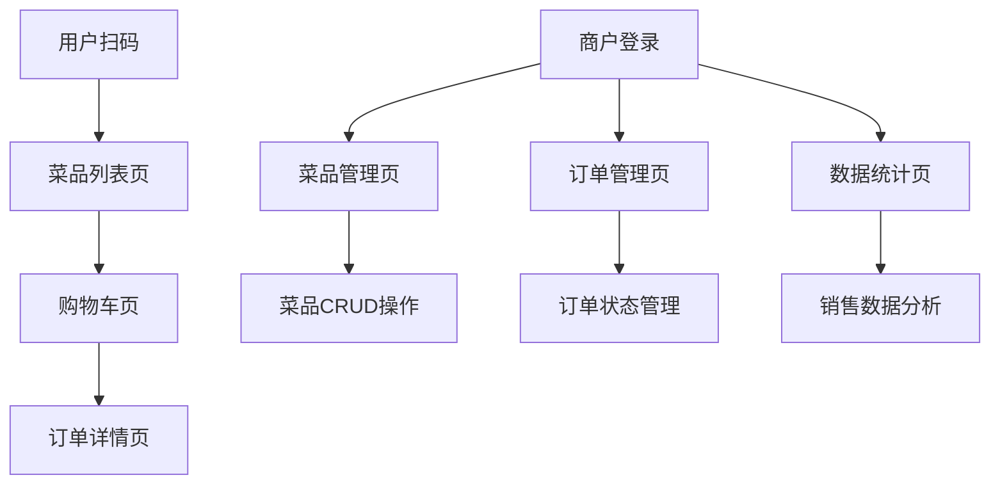

# 餐厅点餐系统产品需求文档

## 1. 产品概述

餐厅点餐系统是一个完整的数字化点餐解决方案，包含用户扫码点餐小程序、商户管理后台和后端API服务。系统支持用户扫码进入商户页面点餐、商户管理菜品和订单、实时订单状态跟踪等核心功能。

该系统旨在提升餐厅运营效率，减少人工成本，为用户提供便捷的点餐体验，帮助商户实现数字化转型和精细化运营管理。

## 2. 核心功能

### 2.1 用户角色

| 角色   | 注册方式      | 核心权限                  |
| ---- | --------- | --------------------- |
| 普通用户 | 微信小程序授权登录 | 扫码点餐、查看订单状态、选择堂食/打包   |
| 商户用户 | 账号密码注册登录  | 菜品管理、订单管理、数据统计、商户信息管理 |

### 2.2 功能模块

我们的餐厅点餐系统包含以下主要页面：

1. **用户端小程序页面**：扫码进入、菜品列表、购物车、订单详情
2. **商户端管理页面**：登录页面、菜品管理、订单管理、数据统计
3. **后端API服务**：用户认证、数据管理、业务逻辑处理

### 2.3 页面详情

| 页面名称      | 模块名称     | 功能描述                   |
| --------- | -------- | ---------------------- |
| 用户端-菜品列表页 | 商户信息展示   | 显示商户名称、营业状态、联系方式等基本信息  |
| 用户端-菜品列表页 | 菜品展示模块   | 展示菜品图片、名称、价格、描述，支持分类筛选 |
| 用户端-菜品列表页 | 购物车模块    | 添加菜品到购物车，显示数量和总价       |
| 用户端-购物车页  | 订单确认模块   | 确认菜品信息、选择堂食/打包、填写备注    |
| 用户端-购物车页  | 支付模块     | 计算总价、提交订单（状态：待确认）      |
| 用户端-订单详情页 | 订单状态跟踪   | 实时显示订单状态：待确认→待烹饪→待取餐   |
| 用户端-订单详情页 | 排队信息显示   | 显示当前排队号码和预计等待时间        |
| 商户端-登录页   | 用户认证     | 账号密码登录，JWT token验证     |
| 商户端-菜品管理页 | 菜品CRUD操作 | 新增、编辑、删除菜品，支持图片上传      |
| 商户端-菜品管理页 | 菜品分类管理   | 创建和管理菜品分类，拖拽排序         |
| 商户端-订单管理页 | 订单列表展示   | 显示所有订单，支持状态筛选和时间筛选     |
| 商户端-订单管理页 | 订单状态管理   | 修改订单状态：待确认→待烹饪→待取餐     |
| 商户端-数据统计页 | 销售统计图表   | 按天/周/月统计销售额和订单数，折线图展示  |
| 商户端-数据统计页 | 热销菜品分析   | 统计菜品销量排行，饼图展示占比        |

## 3. 核心流程

### 用户点餐流程

1. 用户扫描商户二维码进入小程序
2. 浏览菜品列表，选择菜品加入购物车
3. 进入购物车确认订单信息，选择堂食或打包
4. 提交订单，订单状态变为"待确认"
5. 实时查看订单状态和排队信息

### 商户管理流程

1. 商户登录管理后台
2. 管理菜品信息（增删改查、图片上传）
3. 处理订单（确认订单→开始烹饪→完成制作）
4. 查看销售数据和统计报表

## 4. 用户界面设计

### 4.1 设计风格

* **主色调**：#FF6B35（橙色）作为主色，#FFFFFF（白色）作为背景色

* **辅助色**：#F8F9FA（浅灰）用于卡片背景，#6C757D（深灰）用于文字

* **按钮样式**：圆角矩形按钮，主按钮使用橙色背景白色文字

* **字体**：微信小程序端使用系统默认字体，商户端使用 'Helvetica Neue', Arial, sans-serif

* **布局风格**：卡片式布局，顶部导航栏，底部标签栏（小程序端）

* **图标风格**：使用线性图标，简洁现代风格

### 4.2 页面设计概览

| 页面名称      | 模块名称   | UI元素                            |
| --------- | ------ | ------------------------------- |
| 用户端-菜品列表页 | 顶部商户信息 | 商户名称使用18px粗体，营业状态用绿色圆点标识        |
| 用户端-菜品列表页 | 菜品卡片   | 左侧100x100px菜品图片，右侧菜品信息，价格使用橙色高亮 |
| 用户端-购物车页  | 菜品列表   | 白色卡片背景，左滑删除功能，数量选择器             |
| 用户端-订单详情页 | 状态进度条  | 三段式进度条，当前状态高亮显示                 |
| 商户端-登录页   | 登录表单   | 居中布局，输入框圆角设计，登录按钮全宽度            |
| 商户端-菜品管理页 | 菜品表格   | Element Plus表格组件，操作按钮使用不同颜色区分   |
| 商户端-订单管理页 | 订单卡片   | 卡片式布局，状态标签使用不同颜色，操作按钮右对齐        |
| 商户端-数据统计页 | 图表区域   | 使用ECharts图表库，折线图和饼图，响应式布局       |

### 4.3 响应式设计

* **用户端小程序**：专为移动端设计，适配不同尺寸手机屏幕，支持触摸操作优化

* **商户端管理系统**：桌面优先设计，支持平板和手机端适配，侧边栏在小屏幕下可收缩

