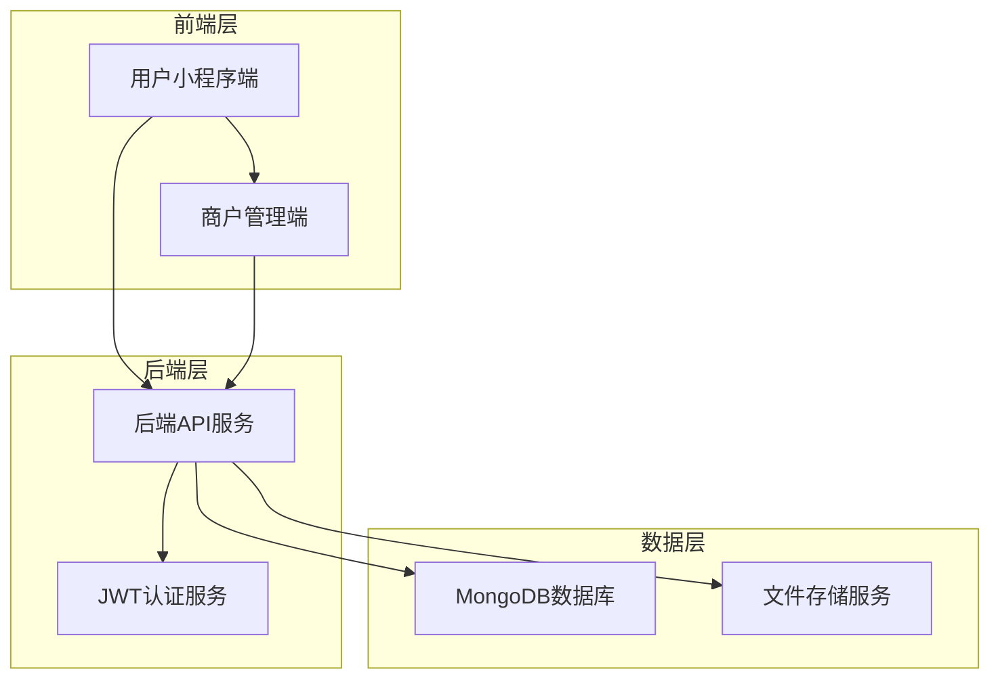
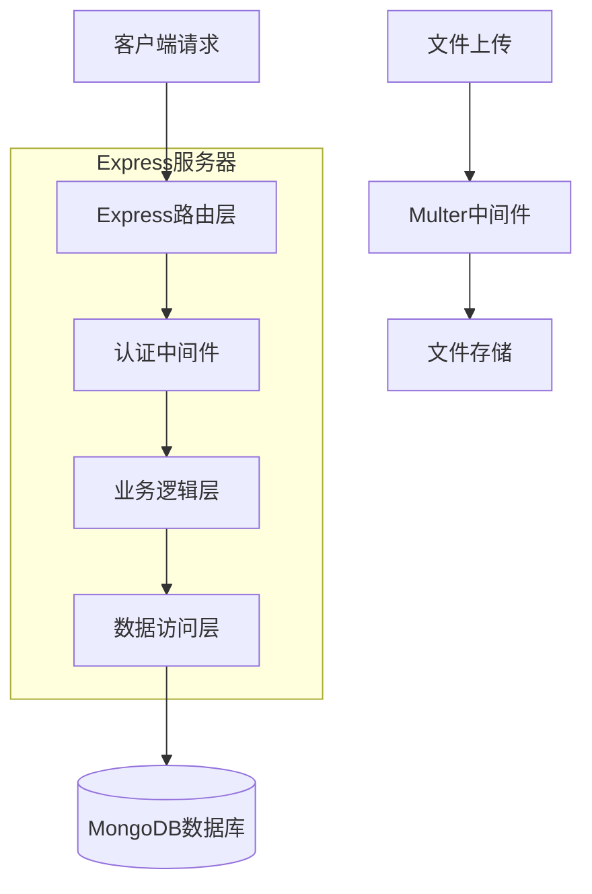
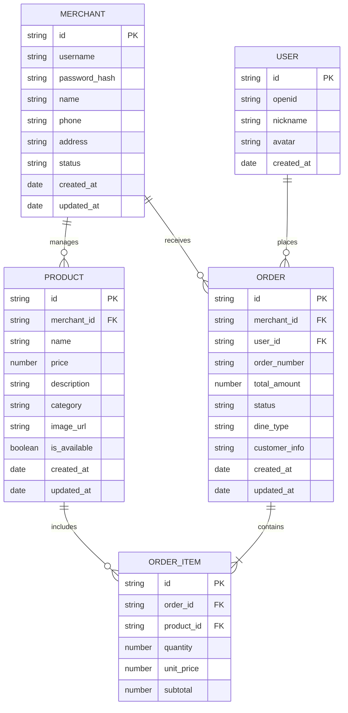

# 餐厅点餐系统技术架构文档

## 1. 架构设计



## 2. 技术描述

* **后端API**: Node.js\@18 + Express\@4 + Mongoose\@7 + JWT + Multer

* **用户端小程序**: Vue3 + uni-app + uni-ui

* **商户端管理**: Vue3 + Vite + Element Plus + ECharts + Axios

* **数据库**: MongoDB Atlas (云数据库)

* **文件存储**: 本地存储 / 阿里云OSS (可选)

## 3. 路由定义

### 3.1 用户端小程序路由

| 路由                   | 用途           |
| -------------------- | ------------ |
| /pages/index/index   | 首页，扫码进入或商户选择 |
| /pages/menu/menu     | 菜品列表页，显示商户菜品 |
| /pages/cart/cart     | 购物车页面，确认订单信息 |
| /pages/order/order   | 订单详情页，查看订单状态 |
| /pages/orders/orders | 订单列表页，查看历史订单 |

### 3.2 商户端管理路由

| 路由          | 用途            |
| ----------- | ------------- |
| /login      | 商户登录页面        |
| /dashboard  | 仪表盘首页，数据概览    |
| /products   | 菜品管理页面，CRUD操作 |
| /orders     | 订单管理页面，状态管理   |
| /statistics | 数据统计页面，图表展示   |
| /profile    | 商户信息管理页面      |

## 4. API定义

### 4.1 认证相关API

**商户登录**

```
POST /api/auth/login
```

请求参数:

| 参数名      | 参数类型   | 是否必需 | 描述    |
| -------- | ------ | ---- | ----- |
| username | string | true | 商户用户名 |
| password | string | true | 密码    |

响应参数:

| 参数名      | 参数类型    | 描述      |
| -------- | ------- | ------- |
| success  | boolean | 请求是否成功  |
| token    | string  | JWT认证令牌 |
| merchant | object  | 商户信息    |

示例:

```json
{
  "username": "merchant001",
  "password": "123456"
}
```

### 4.2 菜品管理API

**获取菜品列表**

```
GET /api/products?merchantId={merchantId}
```

**创建菜品**

```
POST /api/products
```

请求参数:

| 参数名         | 参数类型   | 是否必需  | 描述   |
| ----------- | ------ | ----- | ---- |
| name        | string | true  | 菜品名称 |
| price       | number | true  | 菜品价格 |
| description | string | false | 菜品描述 |
| category    | string | true  | 菜品分类 |
| image       | file   | false | 菜品图片 |
| merchantId  | string | true  | 商户ID |

### 4.3 订单管理API

**创建订单**

```
POST /api/orders
```

请求参数:

| 参数名          | 参数类型   | 是否必需  | 描述                     |
| ------------ | ------ | ----- | ---------------------- |
| merchantId   | string | true  | 商户ID                   |
| items        | array  | true  | 订单商品列表                 |
| totalAmount  | number | true  | 订单总金额                  |
| dineType     | string | true  | 用餐方式：dine\_in/takeaway |
| customerInfo | object | false | 客户信息                   |

**更新订单状态**

```
PUT /api/orders/{orderId}/status
```

请求参数:

| 参数名    | 参数类型   | 是否必需 | 描述                         |
| ------ | ------ | ---- | -------------------------- |
| status | string | true | 订单状态：pending/cooking/ready |

### 4.4 统计分析API

**获取销售统计**

```
GET /api/statistics/sales?merchantId={merchantId}&period={period}
```

参数说明:

* period: daily/weekly/monthly

## 5. 服务器架构图



## 6. 数据模型

### 6.1 数据模型定义



### 6.2 数据定义语言

**商户表 (merchants)**

```javascript
// Mongoose Schema
const merchantSchema = new mongoose.Schema({
  username: { type: String, required: true, unique: true },
  password: { type: String, required: true },
  name: { type: String, required: true },
  phone: { type: String, required: true },
  address: { type: String },
  status: { type: String, enum: ['active', 'inactive'], default: 'active' },
  createdAt: { type: Date, default: Date.now },
  updatedAt: { type: Date, default: Date.now }
});

// 创建索引
merchantSchema.index({ username: 1 });
merchantSchema.index({ status: 1 });
```

**用户表 (users)**

```javascript
const userSchema = new mongoose.Schema({
  openid: { type: String, required: true, unique: true },
  nickname: { type: String },
  avatar: { type: String },
  createdAt: { type: Date, default: Date.now }
});

userSchema.index({ openid: 1 });
```

**菜品表 (products)**

```javascript
const productSchema = new mongoose.Schema({
  merchantId: { type: mongoose.Schema.Types.ObjectId, ref: 'Merchant', required: true },
  name: { type: String, required: true },
  price: { type: Number, required: true, min: 0 },
  description: { type: String },
  category: { type: String, required: true },
  imageUrl: { type: String },
  isAvailable: { type: Boolean, default: true },
  createdAt: { type: Date, default: Date.now },
  updatedAt: { type: Date, default: Date.now }
});

productSchema.index({ merchantId: 1, category: 1 });
productSchema.index({ merchantId: 1, isAvailable: 1 });
```

**订单表 (orders)**

```javascript
const orderSchema = new mongoose.Schema({
  merchantId: { type: mongoose.Schema.Types.ObjectId, ref: 'Merchant', required: true },
  userId: { type: mongoose.Schema.Types.ObjectId, ref: 'User' },
  orderNumber: { type: String, required: true, unique: true },
  totalAmount: { type: Number, required: true, min: 0 },
  status: { 
    type: String, 
    enum: ['pending', 'cooking', 'ready', 'completed', 'cancelled'], 
    default: 'pending' 
  },
  dineType: { type: String, enum: ['dine_in', 'takeaway'], required: true },
  customerInfo: {
    phone: String,
    note: String
  },
  items: [{
    productId: { type: mongoose.Schema.Types.ObjectId, ref: 'Product', required: true },
    name: { type: String, required: true },
    quantity: { type: Number, required: true, min: 1 },
    unitPrice: { type: Number, required: true, min: 0 },
    subtotal: { type: Number, required: true, min: 0 }
  }],
  createdAt: { type: Date, default: Date.now },
  updatedAt: { type: Date, default: Date.now }
});

orderSchema.index({ merchantId: 1, status: 1 });
orderSchema.index({ merchantId: 1, createdAt: -1 });
orderSchema.index({ orderNumber: 1 });
```

**初始化数据**

```javascript
// 创建默认商户
const defaultMerchant = {
  username: 'demo_merchant',
  password: '$2b$10$hashedPassword', // 需要加密
  name: '示例餐厅',
  phone: '13800138000',
  address: '示例地址123号',
  status: 'active'
};

// 创建示例菜品
const sampleProducts = [
  {
    name: '宫保鸡丁',
    price: 28.00,
    description: '经典川菜，香辣可口',
    category: '热菜',
    isAvailable: true
  },
  {
    name: '西红柿鸡蛋',
    price: 18.00,
    description: '家常菜，营养丰富',
    category: '热菜',
    isAvailable: true
  }
];
```

